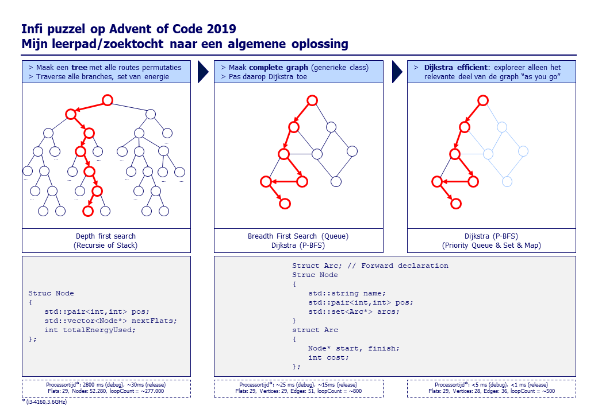
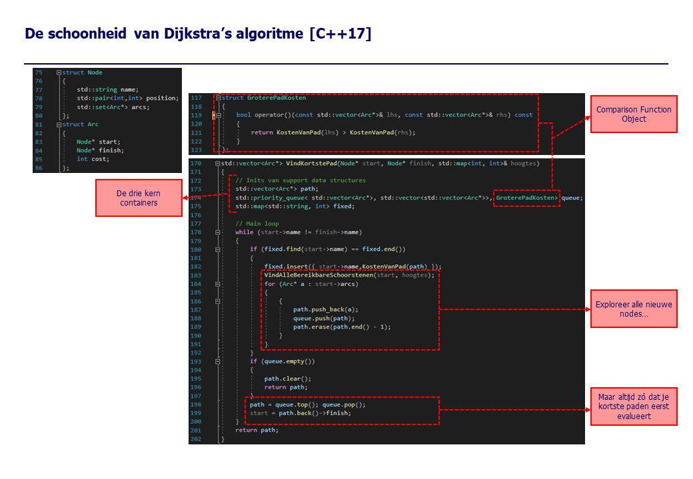
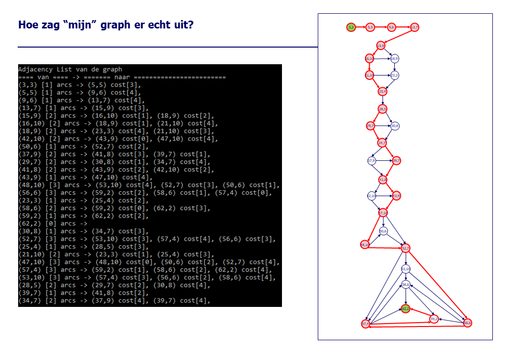

# InfiPuzzle2019_solution3
3e oplossing (C++), nu Dijkstra optimaal

In tegenstelling tot oplossingen #1 en #2 wordt nu niet eerst de volledige graph van alle mogelijke routes geconstrueerd.
Dat is het mooie aan Dijkstra, dat is niet nodig om korste pad naar ieder willekeurig punt te vinden.

Zie comments in main()  

De schoonheid van Dijkstra's idee in de code:
  
 
  

Eerdere oplossingen:
1. Bouwt tree met alle unieke routes (nodes met ontkoppelde vertakkingen); zeer kostbaar maar ontsluit alle mogelijke info ->
[repo oplossing 1](https://github.com/rvdweerd/InfiPuzzle2019.git)
2. Bouwt graph met alle unieke routes (nodes en directed arcs); waarop Dijkstra wordt toegepast -> [repo oplossing 2](https://github.com/rvdweerd/InfiPuzzle2019_solution2.git)

Gepresenteerd bij review:
  
  
  
